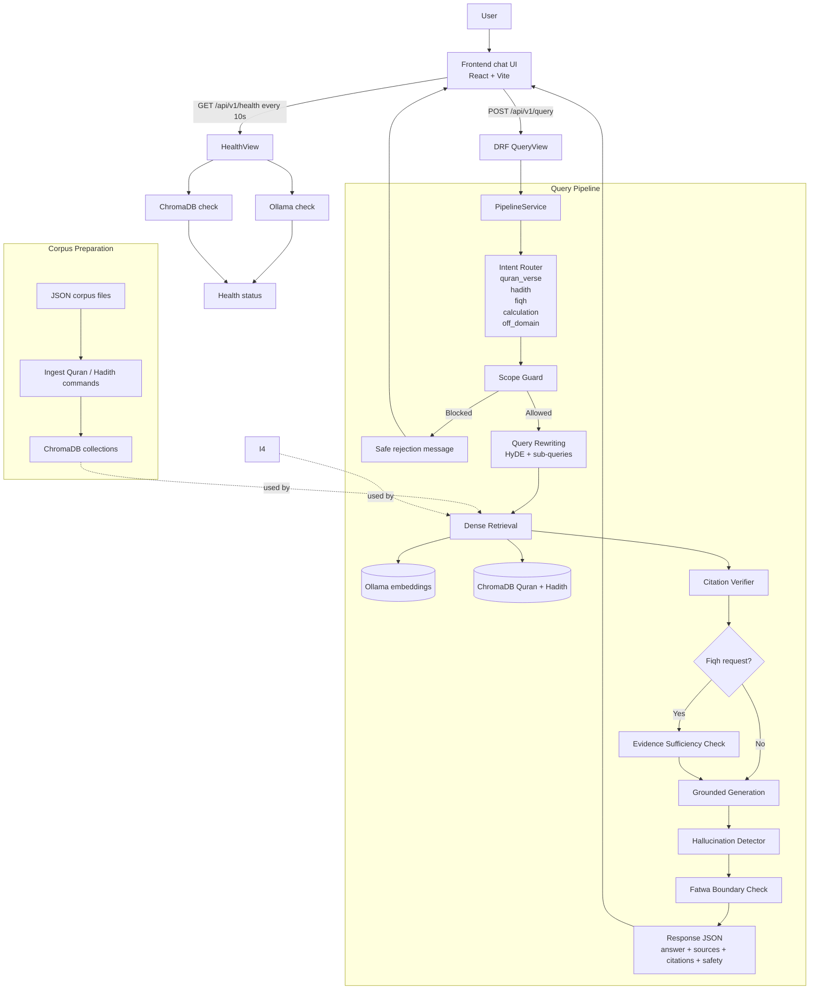

# DivinityAI — Islamic Grounded RAG

A Retrieval-Augmented Generation system that answers questions grounded exclusively in the **Quran** and **authenticated Hadith collections**. Every answer cites verifiable sources — `[Q 2:255]` for Quran, `[C Bukhari/52]` for Hadith.

> **"If it's not in the corpus, don't say it."** — core design principle

---

## Architecture


### Defense-in-Depth Hallucination Mitigation

| Layer | Guard | Mechanism |
|-------|-------|-----------|
| 1 | Corpus lock | LLM only sees retrieved chunks, never training data |
| 2 | Source tagging | Every chunk carries a verifiable `[Q N:NN]` or `[C Name/N]` tag |
| 3 | Citation verifier | Deterministic Python string matching (exact → normalized → fuzzy) |
| 4 | Post-gen check | LLM verifies its own output against source passages |

---

## Quick Start

### Prerequisites

- **Python 3.11+**
- **Node.js 22+**
- **Ollama** running on `localhost:11434` with `embeddinggemma` model
- **ChromaDB** running on `localhost:8040`
- **OpenRouter API key** (for LLM calls)

### 1. Clone & Configure

```bash
git clone <repo-url>
cd divinityai

# Copy and edit environment
cp .env.example .env
# Edit .env — set OPENROUTER_API_KEY, adjust hosts if needed

# Frontend env
cp frontend/.env.example frontend/.env
```

### 2. Backend Setup

```bash
cd backend
python -m venv ../venv
source ../venv/bin/activate

pip install -r requirements.txt
python manage.py migrate
python manage.py runserver 0.0.0.0:8000
```

### 3. Frontend Setup

```bash
cd frontend
npm install
npm run dev
```

### 4. Ingest Corpus Data

Place your corpus JSON files in `backend/corpus/data/`:

```
backend/corpus/data/
├── quran_ayahs.json       # 6,236 ayahs with Arabic + English
├── hadith_bukhari.json    # Sahih Bukhari
└── hadith_muslim.json     # Sahih Muslim
```

Then run:

```bash
cd backend
python manage.py ingest_quran
python manage.py ingest_hadith --collections bukhari,muslim
```

### 5. Open the App

- **Frontend**: http://localhost:5173
- **Backend API**: http://localhost:8000/api/v1/health

---

## Docker

```bash
# Start all services
docker compose up -d

# Backend on host:8899
# Frontend on host:5899

# Check health
curl http://localhost:8899/api/v1/health
```

---

## API Reference

### POST `/api/v1/query`

Run the full RAG pipeline.

**Request:**
```json
{
  "query": "What does the Quran say about patience?",
  "language": "en",
  "max_sources": 5
}
```

**Response:**
```json
{
  "query": "What does the Quran say about patience?",
  "intent": "quran_verse",
  "answer": "The Quran emphasizes patience (sabr) extensively. Allah says 'O you who have believed, seek help through patience and prayer. Indeed, Allah is with the patient.' [Q 2:153].",
  "sources": [
    {
      "source_tag": "Q 2:153",
      "corpus": "quran",
      "text_ar": "يَا أَيُّهَا الَّذِينَ آمَنُوا اسْتَعِينُوا بِالصَّبْرِ وَالصَّلَاةِ",
      "text_en": "O you who have believed, seek help through patience and prayer...",
      "verification_status": "exact",
      "retrieval_score": 0.94
    }
  ],
  "citations": ["Q 2:153"],
  "safety": {
    "hallucination_detected": false,
    "flagged_spans": [],
    "fatwa_boundary_triggered": false,
    "disclaimer": null
  },
  "pipeline_meta": {
    "phase": 2,
    "elapsed": 3.214,
    "llm_calls": 4
  }
}
```

### GET `/api/v1/health`
```json
{ "status": "ok", "phase": 2 }
```

### GET `/api/v1/corpus/stats`
```json
{ "quran_collection": { "document_count": 6236 }, "hadith_collection": { "document_count": 14753 } }
```

---

## Environment Variables

| Variable | Default | Description |
|----------|---------|-------------|
| `OPENROUTER_API_KEY` | — | OpenRouter API key (required) |
| `OPENROUTER_DEFAULT_MODEL` | `google/gemini-2.5-flash` | Default LLM model |
| `OLLAMA_BASE_URL` | `http://localhost:11434` | Ollama embedding API |
| `OLLAMA_EMBED_MODEL` | `embeddinggemma` | Ollama embedding model |
| `CHROMA_HOST` | `localhost` | ChromaDB server host |
| `CHROMA_PORT` | `8040` | ChromaDB server port |
| `CHROMA_CLIENT_SERVER_MODE` | `True` | Use client-server mode |
| `QURAN_COLLECTION` | `quran_collection` | ChromaDB Quran collection |
| `HADITH_COLLECTION` | `hadith_collection` | ChromaDB Hadith collection |
| `RAG_PHASE` | `2` | Pipeline phase (1=basic, 2=full) |
| `BM25_INDEX_DIR` | `backend/corpus/bm25_indexes` | BM25 index storage |

---

## Project Structure

```
divinityai/
├── backend/
│   ├── backend/              # Django project settings
│   ├── chroma/               # ChromaDB utilities
│   ├── corpus/               # Corpus ingestion + BM25
│   │   ├── arabic_utils.py   # Arabic normalization
│   │   ├── bm25_index.py     # BM25 index wrapper
│   │   ├── ingestion.py      # Corpus loading
│   │   └── management/       # ingest_quran, ingest_hadith, build_indexes
│   ├── generation/           # LLM service (OpenRouter)
│   ├── qa/                   # RAG pipeline orchestration
│   │   ├── pipeline.py       # PipelineService orchestrator
│   │   ├── intent_router.py  # Intent classification
│   │   ├── scope_guard.py    # Off-domain rejection
│   │   ├── query_rewriter.py # HyDE + sub-query decomposition
│   │   ├── citation_verifier.py  # (retrieval/ — citation cascade)
│   │   ├── hallucination_detector.py
│   │   ├── fatwa_boundary.py
│   │   ├── serializers.py    # DRF serializers
│   │   └── views.py          # API endpoints
│   ├── retrieval/            # Hybrid retrieval (BM25 + dense)
│   └── router/               # ChromaDB CRUD views
├── frontend/
│   └── src/
│       ├── App.jsx           # Chatbot UI
│       └── index.css         # Tailwind + Islamic theme
├── docs/
│   └── prd-quran-hadith-rag.md
├── docker-compose.yml
├── Dockerfile.backend
├── Dockerfile.frontend
├── nginx.conf
└── README.md
```

---

## Tech Stack

| Layer | Technology |
|-------|-----------|
| Backend | Django 5.2, Django REST Framework |
| LLM | OpenRouter (Gemini, Llama, etc.) |
| Embeddings | Ollama `embeddinggemma` |
| Vector DB | ChromaDB (client-server) |
| Sparse retrieval | `rank_bm25` (BM25Okapi) |
| Fuzzy matching | `rapidfuzz` |
| Arabic NLP | Custom normalization (NFKD + tashkeel stripping) |
| Frontend | React 19, Vite, Tailwind CSS v4 |
| Infrastructure | Docker, Nginx |

---

## Corpus

| Source | Collection | Count |
|--------|-----------|-------|
| Quran | King Fahd Complex Uthmani | 6,236 ayahs |
| Hadith | Sahih Bukhari | ~7,563 |
| Hadith | Sahih Muslim | ~7,190 |
| Hadith | Sunan Abu Dawud | ~5,274 |
| Hadith | Jami' at-Tirmidhi | ~3,956 |
| Hadith | Sunan an-Nasa'i | ~5,762 |
| Hadith | Sunan Ibn Majah | ~4,341 |

Each chunk is one ayah (Quran) or one hadith narration (Hadith), tagged with `[Q surah:ayah]` or `[C collection/number]`.

---

## License & Disclaimer

This system **does not issue fatwas** — it presents what the sources say, not rulings. For definitive rulings on sensitive jurisprudence (divorce, inheritance, usury, medical ethics), consult a qualified scholar.

---

*Built with guidance from the [PRD](docs/prd-quran-hadith-rag.md). See also [CLAUDE.md](CLAUDE.md) for development guidelines.*
