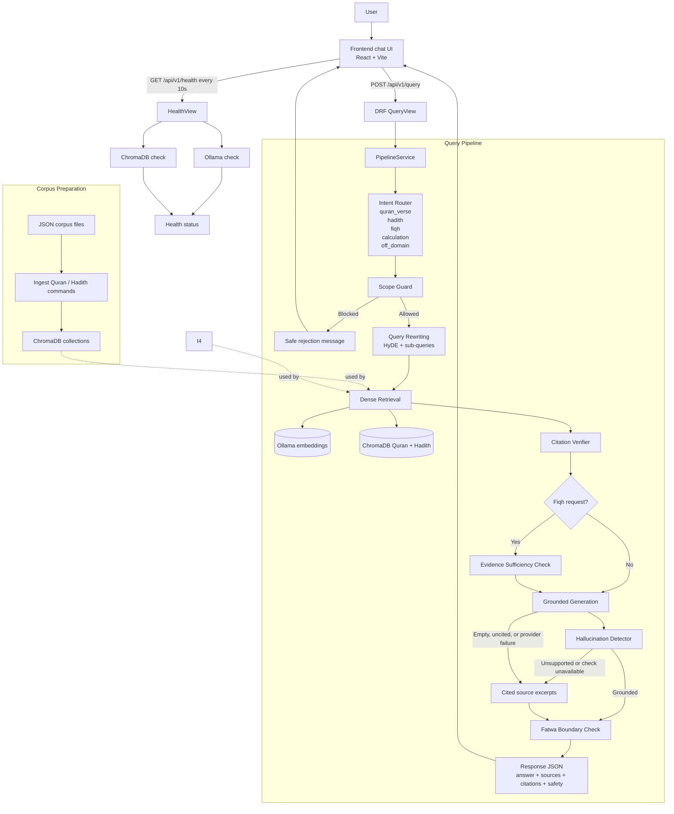

# DivinityAI — Islamic Grounded RAG

A Retrieval-Augmented Generation system that answers questions grounded exclusively in the **Quran** and **authenticated Hadith collections**. Every answer cites verifiable sources — `[Q 2:255]` for Quran, `[C Bukhari/52]` for Hadith.

> **"If it's not in the corpus, don't say it."** — core design principle

---

## Architecture

```mermaid
flowchart TD
    U[User] --> F["Frontend chat UI<br/>React + Vite"]
    F -->|POST /api/v1/query| Q[DRF QueryView]
    Q --> P[PipelineService]

    F -->|GET /api/v1/health every 10s| H[HealthView]

    subgraph Query_Pipeline[Query Pipeline]
        P --> I["Intent Router<br/>quran_verse<br/>hadith<br/>fiqh<br/>calculation<br/>off_domain"]
        I --> S[Scope Guard]
        S -->|Blocked| B[Safe rejection message]
        S -->|Allowed| R["Query Rewriting<br/>HyDE + sub-queries"]
        R --> D[Dense Retrieval]
        D --> O[(Ollama embeddings)]
        D --> C[(ChromaDB Quran + Hadith)]
        D --> V[Citation Verifier]
        V --> E{Fiqh request?}
        E -->|Yes| EC[Evidence Sufficiency Check]
        E -->|No| G[Grounded Generation]
        EC --> G
        G --> H1[Hallucination Detector]
        H1 -->|Grounded| F1[Fatwa Boundary Check]
        H1 -->|Unsupported or check unavailable| CF[Cited source excerpts]
        G -->|Empty, uncited, or provider failure| CF
        CF --> F1
        F1 --> R1["Response JSON<br/>answer + sources + citations + safety"]
    end

    H --> HO[Ollama check]
    H --> HC[ChromaDB check]
    HO --> HS[Health status]
    HC --> HS

    R1 --> F
    B --> F

    subgraph Ingestion[Corpus Preparation]
        I1[JSON corpus files] --> I2["Ingest Quran / Hadith commands"]
        I2 --> I3[ChromaDB collections]
    end

    I3 -. used by .-> D
    I4 -. used by .-> D
```

### Defense-in-Depth Hallucination Mitigation

| Layer | Guard | Mechanism |
|-------|-------|-----------|
| 1 | Corpus lock | Prompt restricts factual claims to retrieved passages |
| 2 | Source tagging | Every chunk carries a verifiable `[Q N:NN]` or `[C Name/N]` tag |
| 3 | Citation verifier | Deterministic Python string matching (exact → normalized → fuzzy) |
| 4 | Post-gen check | Citation allowlist plus an LLM check of all factual claims; failed drafts are replaced with retrieved text |

Low intent confidence does not block retrieval. Incomplete evidence produces a
cautious partial answer with citations and an explicit statement of what the
passages cannot establish. If generation is empty, fails, has no citations, or
cannot be validated, the response quotes the retrieved passages directly and
explains that they may not fully answer the question. When no usable passages
exist, it says so without inventing an answer or references.

Generation uses the same passages returned in `sources`, bounded by
`max_sources`; `citations` lists only references present in the final answer.
Both pipeline phases validate generated claims. `pipeline_meta.answer_mode`
distinguishes `grounded`, `partial`, `context_only`, `no_evidence`, and
`out_of_scope` responses; `evidence_limited` records limited evidence without
treating it as a reason to stop answering. These are flow states, not calibrated
probabilities of correctness.

---

## Quick Start

### Prerequisites

- **Python 3.11+**
- **Node.js 22+**
- **Ollama** running on `localhost:11434` with `embeddinggemma` model
- **ChromaDB** running on `localhost:8040`
- **OpenRouter API key** (for LLM calls)

### 1. Clone & Configure

```bash
git clone <repo-url>
cd divinityai

# Copy and edit environment
cp .env.example .env
# Edit .env — set OPENROUTER_API_KEY, adjust hosts if needed

# Frontend env
cp frontend/.env.example frontend/.env
```

### 2. Backend Setup

```bash
cd backend
python -m venv ../venv
source ../venv/bin/activate

pip install -r requirements.txt
python manage.py migrate
python manage.py runserver 0.0.0.0:8000
```

### 3. Frontend Setup

```bash
cd frontend
npm install
npm run dev
```

### 4. Ingest Corpus Data

Place your corpus JSON files in `backend/corpus/data/`:

```
backend/corpus/data/
├── quran_ayahs.json       # 6,236 ayahs with Arabic + English
├── hadith_bukhari.json    # Sahih Bukhari
└── hadith_muslim.json     # Sahih Muslim
```

Then run:

```bash
cd backend
python manage.py ingest_quran
python manage.py ingest_hadith --collections bukhari,muslim
```

### 5. Open the App

- **Landing page**: http://localhost:5173
- **Chat**: http://localhost:5173/chat.html
- **Backend API**: http://localhost:8000/api/v1/health

### Accounts, Chat History & Memory

Run `python manage.py migrate` in `backend/` when updating an existing installation
(Docker: `docker compose exec backend python manage.py migrate`). This creates the
account preferences, conversation, message, and memory tables in the existing
Django database. Keep `DATABASE_PATH` on persistent storage.

Open the chat page and choose **Create account** or **Sign in**. Accounts use an
email address and password with Django password validation and cookie sessions.
**Account** lets you change your display name; **Sign out** clears private chats
from the current screen. Email verification and email-based password recovery
are not configured.

- Signed-in questions and complete answers (including sources, citations, and
  safety notices) are saved automatically. Use **Chat history** to search, reopen,
  rename, delete, or clear conversations. **New chat** starts a separate thread.
- Follow-up questions use the last six messages of that thread, bounded to
  2,000 characters per message, to resolve references before source retrieval.
- **Memory** lets you add, edit, delete, or clear up to 20 notes of 500 characters
  each. These are explicitly saved preferences; chats do not create memories
  automatically. Turn **Use saved memories in answers** off to keep notes without
  applying them. Memory notes guide explanations and are never source evidence.
- Deleting chat history does not delete memories, and clearing memories does not
  delete chats. Guest conversations remain temporary and are not imported when
  signing in. Previous conversations from before this feature cannot be restored.

For deployment, serve the frontend and `/api` from the same origin, leave
`VITE_API_BASE_URL` empty, set `DEBUG=False`, configure a strong `SECRET_KEY`,
and set `CSRF_TRUSTED_ORIGINS` to the public HTTPS origin. Secure session and CSRF
cookies default to enabled outside debug mode. Separate frontend/backend origins
must be same-site and explicitly listed in both `CORS_ALLOWED_ORIGINS` and
`CSRF_TRUSTED_ORIGINS`. Login and signup have an IP-based throttle using Django's
configured cache; use a shared cache and an edge rate limit for multiple workers.
In local development, `VITE_API_PROXY_TARGET` selects the Django server behind
Vite's `/api` proxy (default `http://localhost:8000`). The proxy preserves the
browser's host and port for CSRF checks, including when Vite uses a fallback port.

---

## Docker

```bash
# Start all services
docker compose up -d

# Backend on host:8899
# Frontend on host:5899

# Check health
curl http://localhost:8899/api/v1/health
```

---

## API Reference

### POST `/api/v1/query`

Run the full RAG pipeline.

For signed-in sessions this also saves the exchange. Include an existing
`conversation_id` (UUID) to continue a thread, or omit it to start a new one.
The response adds a `conversation` object with its ID, title, language, and
timestamps. `save_history: true` explicitly requires a signed-in session, so an
expired session cannot silently turn a saved chat into a guest query.

**Request:**
```json
{
  "query": "What does the Quran say about patience?",
  "language": "en",
  "max_sources": 5
}
```

**Response:**
```json
{
  "query": "What does the Quran say about patience?",
  "intent": "quran_verse",
  "answer": "The Quran emphasizes patience (sabr) extensively. Allah says 'O you who have believed, seek help through patience and prayer. Indeed, Allah is with the patient.' [Q 2:153].",
  "sources": [
    {
      "source_tag": "Q 2:153",
      "corpus": "quran",
      "text_ar": "يَا أَيُّهَا الَّذِينَ آمَنُوا اسْتَعِينُوا بِالصَّبْرِ وَالصَّلَاةِ",
      "text_en": "O you who have believed, seek help through patience and prayer...",
      "verification_status": "exact",
      "retrieval_score": 0.94
    }
  ],
  "citations": ["Q 2:153"],
  "safety": {
    "hallucination_detected": false,
    "flagged_spans": [],
    "fatwa_boundary_triggered": false,
    "disclaimer": null
  },
  "pipeline_meta": {
    "phase": 2,
    "elapsed": 3.214,
    "llm_calls": 4
  }
}
```

### GET `/api/v1/health`
```json
{ "status": "ok", "phase": 2 }
```

### GET `/api/v1/corpus/stats`
```json
{ "quran_collection": { "document_count": 6236 }, "hadith_collection": { "document_count": 14753 } }
```

### Account, History & Memory API

Fetch `GET /api/v1/auth/session` first to get `{user, csrf_token}` (`user` is
`null` for guests). Include cookies and `X-CSRFToken` on every write, including
login and registration. Both return an updated user and rotated CSRF token.
All history and memory endpoints require a signed-in session and only operate
on that account's records. Personal responses use `Cache-Control: no-store`.

| Method | Endpoint | Body / behavior |
|--------|----------|-----------------|
| POST | `/api/v1/auth/register` | `{name, email, password}`; creates an account and signs in |
| POST | `/api/v1/auth/login` | `{email, password}` |
| POST | `/api/v1/auth/logout` | Ends the session |
| PATCH | `/api/v1/auth/profile` | `{name?, memory_enabled?}` |
| GET | `/api/v1/conversations?search=...&page=1` | `{count, next, previous, results}`; 30 per page, newest first |
| DELETE | `/api/v1/conversations` | Deletes all of this account's conversations and messages |
| GET | `/api/v1/conversations/{id}` | Conversation with ordered `messages` and original response metadata |
| PATCH | `/api/v1/conversations/{id}` | `{title}` |
| DELETE | `/api/v1/conversations/{id}` | Deletes the conversation and its messages |
| GET / POST | `/api/v1/memories` | List notes / create with `{content}` |
| PATCH / DELETE | `/api/v1/memories/{id}` | Edit with `{content}` / delete one note |
| DELETE | `/api/v1/memories` | Deletes all of this account's notes |

---

## Environment Variables

| Variable | Default | Description |
|----------|---------|-------------|
| `OPENROUTER_API_KEY` | — | OpenRouter API key (required) |
| `OPENROUTER_DEFAULT_MODEL` | `google/gemini-2.5-flash` | Default LLM model |
| `OLLAMA_BASE_URL` | `http://localhost:11434` | Ollama embedding API |
| `OLLAMA_EMBED_MODEL` | `embeddinggemma` | Ollama embedding model |
| `CHROMA_HOST` | `localhost` | ChromaDB server host |
| `CHROMA_PORT` | `8040` | ChromaDB server port |
| `CHROMA_CLIENT_SERVER_MODE` | `True` | Use client-server mode |
| `QURAN_COLLECTION` | `quran_collection` | ChromaDB Quran collection |
| `HADITH_COLLECTION` | `hadith_collection` | ChromaDB Hadith collection |
| `RAG_PHASE` | `2` | Pipeline phase (1=basic with grounding checks, 2=full) |
| `RAG_MAX_DISTANCE` | disabled | Prefer matches within this distance; use weaker matches only for a limited answer when none pass |
| `BM25_INDEX_DIR` | `backend/corpus/bm25_indexes` | BM25 index storage |

---

## Project Structure

```
divinityai/
├── backend/
│   ├── backend/              # Django project settings
│   ├── accounts/             # Session auth, private chat history, saved memories
│   ├── chroma/               # ChromaDB utilities
│   ├── corpus/               # Corpus ingestion + BM25
│   │   ├── arabic_utils.py   # Arabic normalization
│   │   ├── bm25_index.py     # BM25 index wrapper
│   │   ├── ingestion.py      # Corpus loading
│   │   └── management/       # ingest_quran, ingest_hadith, build_indexes
│   ├── generation/           # LLM service (OpenRouter)
│   ├── qa/                   # RAG pipeline orchestration
│   │   ├── pipeline.py       # PipelineService orchestrator
│   │   ├── intent_router.py  # Intent classification
│   │   ├── scope_guard.py    # Off-domain rejection
│   │   ├── query_rewriter.py # HyDE + sub-query decomposition
│   │   ├── citation_verifier.py  # (retrieval/ — citation cascade)
│   │   ├── hallucination_detector.py
│   │   ├── fatwa_boundary.py
│   │   ├── serializers.py    # DRF serializers
│   │   └── views.py          # API endpoints
│   ├── retrieval/            # Hybrid retrieval (BM25 + dense)
│   └── router/               # ChromaDB CRUD views
├── frontend/
│   ├── index.html            # Landing page (static HTML, SEO entry point)
│   ├── chat.html             # Chat app entry
│   └── src/
│       ├── App.jsx           # Chatbot UI
│       └── index.css         # Tailwind + Islamic theme
├── docs/
│   └── prd-quran-hadith-rag.md
├── docker-compose.yml
├── Dockerfile.backend
├── Dockerfile.frontend
├── nginx.conf
└── README.md
```

---

## Tech Stack

| Layer | Technology |
|-------|-----------|
| Backend | Django 5.2, Django REST Framework |
| LLM | OpenRouter (Gemini, Llama, etc.) |
| Embeddings | Ollama `embeddinggemma` |
| Vector DB | ChromaDB (client-server) |
| Sparse retrieval | `rank_bm25` (BM25Okapi) |
| Fuzzy matching | `rapidfuzz` |
| Arabic NLP | Custom normalization (NFKD + tashkeel stripping) |
| Frontend | React 19, Vite, Tailwind CSS v4 |
| Infrastructure | Docker, Nginx |

---

## Corpus

| Source | Collection | Count |
|--------|-----------|-------|
| Quran | King Fahd Complex Uthmani | 6,236 ayahs |
| Hadith | Sahih Bukhari | ~7,563 |
| Hadith | Sahih Muslim | ~7,190 |
| Hadith | Sunan Abu Dawud | ~5,274 |
| Hadith | Jami' at-Tirmidhi | ~3,956 |
| Hadith | Sunan an-Nasa'i | ~5,762 |
| Hadith | Sunan Ibn Majah | ~4,341 |

Each chunk is one ayah (Quran) or one hadith narration (Hadith), tagged with `[Q surah:ayah]` or `[C collection/number]`.

---

## License & Disclaimer

This system **does not issue fatwas** — it presents what the sources say, not rulings. For definitive rulings on sensitive jurisprudence (divorce, inheritance, usury, medical ethics), consult a qualified scholar.

---

*Built with guidance from the [PRD](docs/prd-quran-hadith-rag.md). See also [CLAUDE.md](CLAUDE.md) for development guidelines.*
